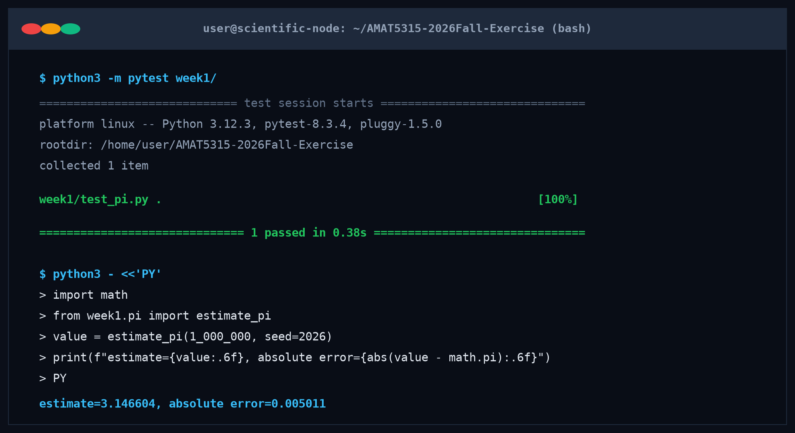

# AMAT5315: Scientific Computing for Physicists - Weekly Exercises

This repository stores my weekly exercises for AMAT5315 (Scientific Computing
for Physicists). Each week lives in its own folder (`week1/`, `week2/`, `week3/`, `week4/`)
containing the task specification in `SPEC.md`, the implementation, and the
tests that verify it.

- **Interactive Web Labs**:
  - [Week 1: AI Agents & Monte Carlo Pi Lab](https://imgrj.github.io/AMAT5315-2026Fall-Exercise/week1-pi-lab.html)
  - [Week 2: Molecular Dynamics Simulation](https://imgrj.github.io/AMAT5315-2026Fall-Exercise/index.html)
  - [Week 3: Ising Lattice Lab](https://imgrj.github.io/AMAT5315-2026Fall-Exercise/week3-ising-lab.html)
  - [Week 4: Continuum Fluid Dynamics Lab](https://imgrj.github.io/AMAT5315-2026Fall-Exercise/week4-fluid-lab.html)

---

## Week 1: AI Agents & Monte Carlo $\pi$ Estimator

Week 1 contains `pi.py`, a Monte Carlo estimator of $\pi$ using pseudo-random dart throws in the unit square, along with `test_pi.py`.

### Install Dependencies

Install pytest with pip:

```bash
python3 -m pip install pytest
```

### Run the Week 1 Tests

From the repository root, run:

```bash
python3 -m pytest week1/
```

This runs `test_pi.py`, which checks that `estimate_pi(1_000_000, seed=2026)` is within `1e-2` of `math.pi`.

### Run Numerical Estimate & Verify Error

```bash
python3 - <<'PY'
import math
from week1.pi import estimate_pi
value = estimate_pi(1_000_000, seed=2026)
print(f"estimate={value:.6f}, absolute error={abs(value - math.pi):.6f}")
PY
```

Expected output:
```
estimate=3.146604, absolute error=0.005011
```

### Numerical Verification Evidence


