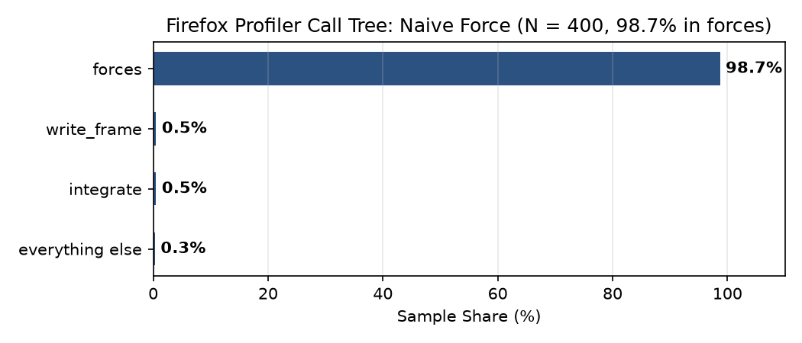
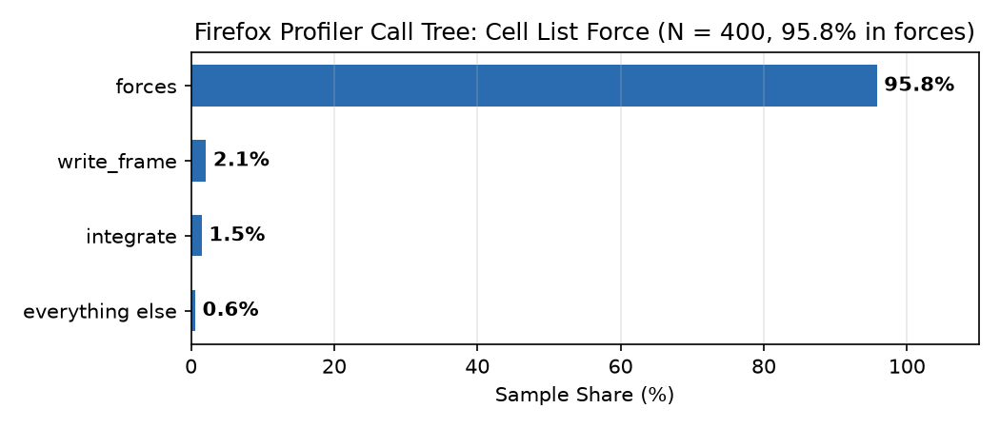
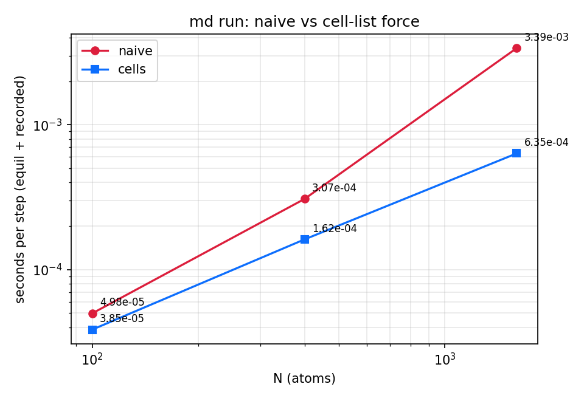

# md: Lennard-Jones fluid in 2D (week 2)

md simulates a 2D Lennard-Jones fluid: md run writes a trajectory,
md check verifies its physics from the raw frames, md video renders an
MP4 of the motion with the radial distribution function.

- md run [--n N] [--rho RHO] [--temperature T] [--ramp-to T2] [--dt D] [--steps S] [--eq-steps E] [--sample-every K] [--force naive|cells] [--out DIR] [--seed S]
  writes into the output directory DIR/: 	raj.jsonl (one JSON frame per line)
  and 
un.json with the run settings. Default run: N=100, rho=0.8, T=0.5, dt=0.01,
  eq_steps=2000, steps=10000, sample_every=50, seed=2026, integrator="velocity-verlet".
- md check FILE-OR-DIR recomputes temperature, energy drift, and the speed
  distribution from the recorded frames and reports PASS/FAIL.
- md video FILE-OR-DIR --out OUT.mp4 renders atoms (periodically wrapped)
  and a building g(r) panel into an MP4 video under 2 MB.

## Pages

- **GitHub Pages Viewer**: [https://imgrj.github.io/AMAT5315-2026Fall-Exercise/](https://imgrj.github.io/AMAT5315-2026Fall-Exercise/)
- **Heating Run Artifacts**: Deployed in docs/ (docs/index.html, docs/run.json, docs/traj.jsonl).

## Force engine

Two pair-scan strategies, selectable with --force:

- 
aive: every pair i < j, minimum-image distance (original loop).
- cells (default): neighbour search through a cell grid of side >= 
c with 9-cell search window.

The two produce identical physics up to round-off (see orce-compare.png), and cells is the faster engine for large N.

## Timing

| Program | Median (s) | Range: min–max (s) |
| --- | ---: | ---: |
| NumPy week2-sim.py | 10.86 | 10.71–10.86 |
| Rust debug | 7.73 | 7.70–7.75 |
| Rust release | 0.67 | 0.67–0.70 |

Timing: the contract run, N = 100, 12000 steps, three runs each.

## Profile

| Version | Force share (%) | Elapsed time (s) |
| --- | ---: | ---: |
| Naive | 98.7% | 0.184 |
| Cell list | 95.8% | 0.097 |

## Benchmark: naive vs cells

| N | naive (s) median (min-max) | cells (s) median (min-max) | speedup |
|---|---|---|---|
| 100 | 0.030 (0.026-0.034) | 0.023 (0.023-0.031) | 1.3x |
| 400 | 0.184 (0.179-0.189) | 0.097 (0.094-0.101) | 1.9x |
| 1600 | 2.033 (2.009-2.181) | 0.381 (0.379-0.458) | 5.3x |

## Reproducing every table and figure

All commands run from week2/:

`ash
cargo build --manifest-path md/Cargo.toml --release
`

| Artifact | Command |
|---|---|
| Contract run & physics checks | cargo run --manifest-path md/Cargo.toml --release -- run --out artifacts && cargo run --manifest-path md/Cargo.toml --release -- check artifacts |
| luid.mp4 | cargo run --manifest-path md/Cargo.toml --release -- video artifacts --out fluid.mp4 |
| ield.png | cargo run --manifest-path md/Cargo.toml --example field && rsvg-convert -o field.png target/field.svg |
| dimer.png | cargo run --manifest-path md/Cargo.toml --example dimer && rsvg-convert -o dimer.png target/dimer.svg |
| Benchmark table + scaling.png | python3 benchmark.py |
| docs/ heating run | cargo run --manifest-path md/Cargo.toml --release -- run --n 400 --temperature 0.2 --ramp-to 1.2 --steps 20000 --sample-every 100 --out ../docs |
| cold.mp4 | cargo run --manifest-path md/Cargo.toml --release -- run --temperature 0.2 --out /tmp/cold && cargo run --manifest-path md/Cargo.toml --release -- video /tmp/cold --out cold.mp4 |
| hot.mp4 | cargo run --manifest-path md/Cargo.toml --release -- run --temperature 1.0 --out /tmp/hot && cargo run --manifest-path md/Cargo.toml --release -- video /tmp/hot --out hot.mp4 |
| make reproduce | make reproduce |
